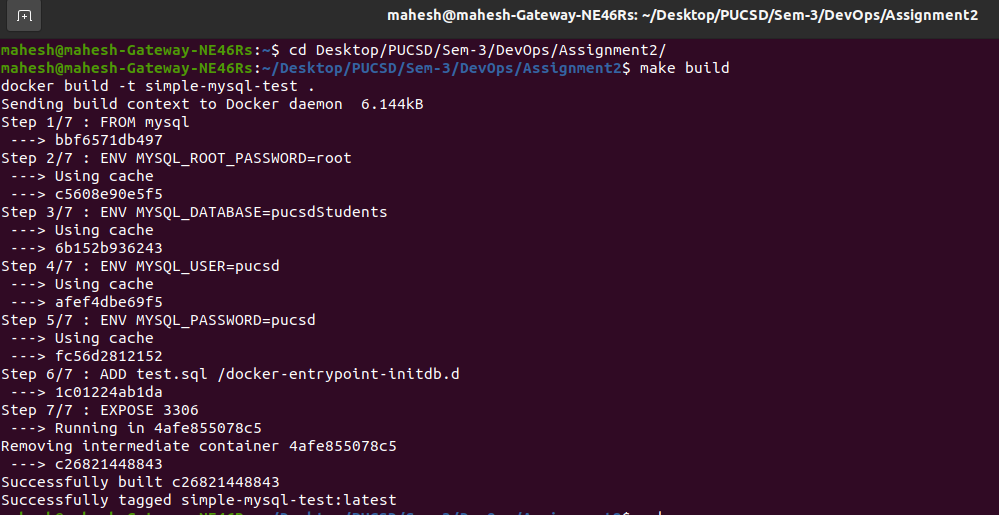
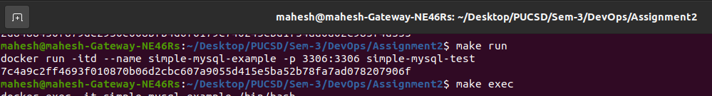
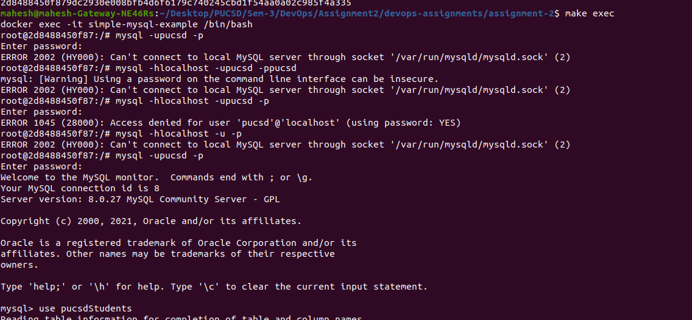
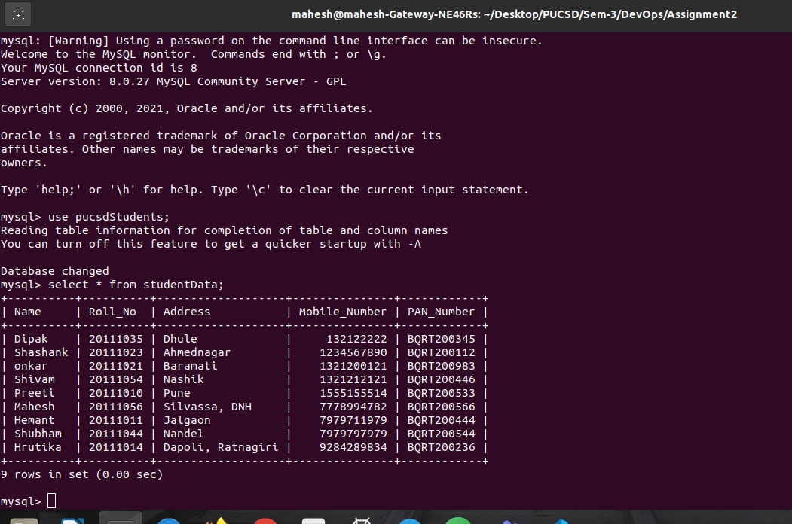

#                  Assignment-2: 
# Dockerfile-Build image with loaded MySQL schema

In this assignment we have to write Dockerfile from which we can build our require image to start the container to achive our target. <br>
Our target is whenever the container start we should see the database having students table containing your roll number, name and course.<br>
I have used mysql image to build my customize image and to start the container.<br>
Basically,we need to write a queries for create table and insert data in the test.sql file and load this file in the Dockerfile.

## Getting Started

1. Clone the project

2. make build


3. make run


4. Please make sure that container is running successfully by using `docker ps` command

5. make exec





### Prerequisite
```
Docker
Make
```


